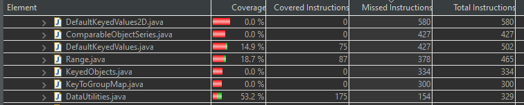
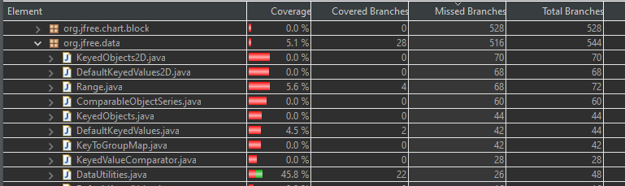
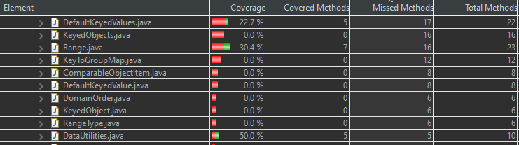
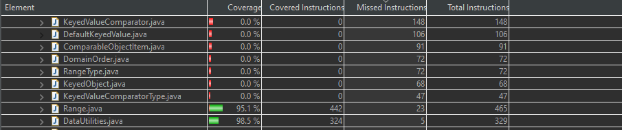
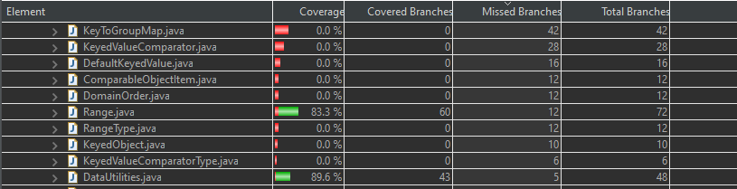
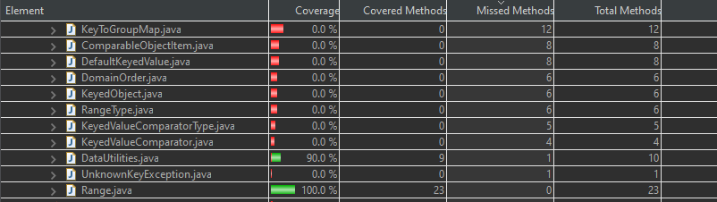

**SENG 438 - Software Testing, Reliability, and Quality**

**Lab. Report #3 – Code Coverage, Adequacy Criteria and Test Case Correlation**

| Group \#:      | 04          |
| -------------- | ----------- |
| Student Names: | Azlan Amjad |
|                | Saud Agha   |
|                | Sajid Hafiz |
|                | Rohan Amjad |

# 1 Introduction

This lab introduced white box testing practices, specifically deriving test cases based on the analysis of the source code of JFreeChart. These new test cases were used in conjunction with code coverage tools such as EclEmma  to determine the new code coverage of the SUT. 

# 2 Manual data-flow coverage calculations for X and Y methods

DataUtilities - calculateColumnTotal(): 

Data Flow Graph: 

def-use sets per statement:

def(1): {data, column}

use(1): {}

def(2): {total, rowCount}

use(2): {data}

def(3): {r}

use(3): {r}

def(4): {n}

use(4): {data}

def(5): {}

use(5): {}

def(6): {}

use(6): {n}

def(7): {}

use(7): {}

def(8): {total}

use(8): {n}

DU-pairs per variable:

data:

{1,2}, {1,4}

column: 

{1,4}

total:

rowCount:

{2,4}

r:

{3,3}

n:

{4,6}, {4,8}

Which pairs are covered for each test case:

testCalculateFirstColumnTotal: {1,2}, {1,4}, {2,4}, {3,3}, {4,6}, {4,8}

DU-Pair coverage:

CU = 4

PU = 2

CUc = 4

CUp = 2

CUf = 0

PUf = 0

CU + PU / (CUc + PUc) - (CUf + PUf)

4 + 2 / (4 + 2) - (0 + 0) = 1 * 100% = 100% coverage

Range - getCentralValue(): 

Data Flow Graph: 

def-use sets per statement:

def(1): {lower, upper}

use(1): {}

def(2): {}

use(2): {lower, upper}

def(3): {}

use(3): {}

def(4): {lower, upper}

use(4): {}

def(6): {}

use(6): {lower, upper}

DU-pairs per variable:

lower: 

{1,2}, {1,6}, {4,6} 

upper: 

{1,2}, {1,6}, {4,6}

Which pairs are covered for each test case:

calculatingDoubleMaxtoDoubleMin: {1,2}, {1,6}, {4,6} 

calculatingDoubleMaxPlusOneDoubleMinPlusOne: {1,2}, {1,6}, {4,6} 

calculatingDoubleMaxMinusOneDoubleMinMinusOne: {1,2}, {1,6}, {4,6} 

calculatingZeroAndHundred: {1,2}, {1,6}, {4,6} 

calculatingCentralValueOfTwoNegativeRangeValues: {1,2}, {1,6}, {4,6} 

DU-Pair coverage:

CU = 1

PU = 1

CUc = 1

CUp = 1

CUf = 0

PUf = 0

CU + PU / (CUc + PUc) - (CUf + PUf)

1 + 1 / (1 + 1) - (0 + 0) = 1 * 100% = 100% coverage

# 3 A detailed description of the testing strategy for the new unit test

White-box testing: Control Flow and Data Flow Coverage

For the first part of the test design component, we measure the adequacy of our current test suite using one or more code coverage tools.

## Measuring Control Flow Coverage

To measure control flow coverage of our current test suite, we have decided to use EclEmma.

The first step is to select classes for instrumentation. We have selected **org.jfree.data.DataUtilities** and **org.jfree.data.Range**, since these are the classes we wrote unit tests for in the previous assignment. For the second step, we ran the EclEmma code coverage analysis tool on these classes.

For our current test suite we will report three coverage metrics. The three metrics for each class are listed below. Since the coverage tool that we are using (EclEmma) does not report condition coverage, we will be using method coverage as a metric instead.

DataUtilities
- **Statement/Instruction** Coverage = 175 / 329 * 100% = **53.2%**
- **Branch** Coverage = 22 / 48 * 100% = **45.8%**
- **Method** Coverage = 5 / 10 * 100% = **50.0%**

Range
- **Statement/Instruction** Coverage = 87 / 465 * 100% = **18.7%**
- **Branch** Coverage = 4 / 72 * 100% = **5.6%**
- **Method** Coverage = 7 / 23 * 100% = **30.4%**

## Measuring Data Flow Coverage Manually

For the measurement of Data Flow coverage, we made a Control Flow graph and modified it by adding the defs and uses for each variable. This helped us keep track of the changes in read and write of different variables, and see the flow of data. As a result, we used our test suite from lab 2 which covered the two methods, calculateColumnTotal() and getCentralValue(), and calculated DU-pair coverage using the provided formula. As an additional step, we checked the calculated value with EclEmma's produced coverage, and found that the calculations were consistent with the instructions coverage of 100%. 

## Test Suite Development

We will design new unit tests for the **DataUtilities** and **Range** classes so we can increase their code coverage. The new adequacy criteria are listed below.

Minimum coverage:
- 90% statement coverage
- 70% branch coverage
- 60% method coverage

To begin, we will document a testing plan.

Our group will split the two classes among two subgroups, two individuals will on work on increasing the code coverage of one class. We plan on helping each other where necessary.

The adequacy criteria includes statement, branch, and method coverage. When analyzing the code coverage, we can look at multiple control flow criteria, including statement/instruction/line, decision/branch, condition, and even path coverage.

From our studies we know that Modified Condition-Decision Criterion (MC/DC) subsumes all other testing criterion, including branch and statement coverage. And branch coverage subsumes statement coverage. Therefore if we are able to achieve 100% MC/DC coverage we can assume we have achieved 100% coverage for all other control flow metrics.

To reach the adequacy criteria, we plan to develop tests which focus on increasing the MC/DC coverage and branch coverage, this will ensure we reach the needed coverages for statement, and method. Because we do not have access to a direct condition coverage metric since we are using EclEmma, we will focus on increasing branch coverage, and instinctively develop tests to increase MC/DC coverage.

# 4 A high level description of five selected test cases you have designed using coverage information, and how they have increased code coverage

calculateRowTotal2DRows() - In the initial test suite, we had omitted testing the calculateRowTotal's overloaded method. As a result our instruction, branch, and method coverage suffered. To increase the coverages in DataUtilities, we included testing the overloaded method. We used mocking to input data into the method, using the source code as a reference, and following the "common path". However, as we used the common the path, we did not get 100% for branch  and instructions coverages. To achieve such feat, we must test the output using a null value as one of the inputs, resulting in all the branches being covered.

calculatingPercentageWithNull() - In our initial test suite from lab 2, we did not achieve 100% in branch and instructions coverage for getCumulativePercentages() method. To achieve 100% we needed to test an additional branch. By using mocking, we inputted a null value for one of the inputs, which satisfied an "if statement" in the method which checked for null values. This resulted in all the branches being covered, and in turn all the instructions being covered. 

calculateColumnTotalWithNullValues() - For the method calculateColumnTotal(), we did not testtall the branches due to lack of knowledge of source code. By observing the source code, we noticed that an additional branch which checked for null values was ommitted in our initial test suite. Using mocking, we provided the method with a null value for one of the rows, resulting in the branch being covered. As a result, both our instruction and branch coverage increased for DataUtilities class. 

intersectsTrueFromBottom() - To increase both branch coverage and instruction coverage, test cases were created for intersects(double b1, double b2) method. Previously, 
we did not have any test cases for this method. Since branch coverage is a stronger form of coverage than instruction coverage as it follows that
testing all branches means we have tested all statements, or instructions in the reported metrics. The test cases were created from observing the
source code and recognizing the different branches that originated from the if conditions in the source code. This test case results in one branch being tested. The selected branch being tested is when b0 <= this.lower

intersectTrueFromTop() - As the previous test (intersectsTrueFromBottom) tests one branch of intersects() method. This test, covers the other branch. The source code is executed differently if b0 > this.lower which is a different branch being tested. Together these two test cases give 100% full branch coverage and 100% instruction coverage for the method intersects.

# 5 A detailed report of the coverage achieved of each class and method (a screen shot from the code cover results in green and red color would suffice)

Here is our coverages of test suite which was submitted in lab 2. 

Instruction Coverage: 

Branch Coverage:

Method Coverage:

This is our coverages with the updated test suite (Note: Initial test suite from lab 2 is included, as we added more test cases to increase coverages): 

Instruction Coverage: 

Branch Coverage:

Method Coverage:

# 6 Pros and Cons of coverage tools used and Metrics you report

The metrics we chose are: instruction, branch, and method coverage. The sole tool we used is EclEmma in this lab.

Pros of Instruction Coverage:
Very simple to create test cases for. A stronger form of coverage than method coverage. 

Cons of Instruction Coverage:
Not comprehensive enough to find faults in the system.

Pros of Branch Coverage:
Subsumes instruction coverage which means 100% branch coverage will result in 100% instruction coverage.

Cons of Branch Coverage:
Difficult to create test cases for as an analysis of the control flow of the source code is required.

Pros of Method Coverage:
Very simple to create test cases for.
Cons of Method Coverage:
Very general, not comprehensive enough to find faults in the system.

Pros of EclEmma:
One major pro for EclEmma we found was the ease of use. As the Eclipse IDE has EclEmma built-in, we were quickly able to see our Lab 2 Test Suite's coverage in various "counters" and start work on Lab 3. Unlike Mockito, which is a seperate library and required us to set up Maven for it to fully work, EclEmma had no prerequisite's. 

Cons of EclEmma:
Does not show condition coverage

# 7 A comparison on the advantages and disadvantages of requirements-based test generation and coverage-based test generation.
Although both White Box testing techniques and Black Box testing technique should be used, they do each have their own unique advantages and disadvantages. The advantages of the requirements-based test generation (Black Box testing) is that you don't need the source code at all. You only require the documentation and the system requirements; however, as a disadvantage this also means you sometimes need to make assumptions on how the system is supposed to work which may affect your test cases. Additionally, creating test cases using Black Box testing techniques such as ECT are far more complex than say, branch coverage for White Box testing. The advantages of White Box testing is that you have the source code and no assumptions are required which means it becomes easy to analyze how the data and control flow in the system; however, a disadvantage of White Box testing is that it requires strenuous effort to find hidden errors along a path that may cause problems, for example a divide by zero error that may not become immediately apparent with branch coverage. Additionally, as seen from this lab, White Box testing requires much more time developmnt to hit certain coverage criteria goals. It also requires the use of external code coverage tools wereas Black Box testing requires none. 

# 8 A discussion on how the team work/effort was divided and managed
The group was divided into pairs who would work on each class (DataUtilities & Range). Each member of the pair were given a target for each coverage metric to aim for. Upon completion of all test cases for a single method, it was reviewed by the other member in the pair. The data flow coverage and analysis was completed as a group. 

# 9 Any difficulties encountered, challenges overcome, and lessons learned from performing the lab
The challenges overcome with the lab was specifically with covering branch coverage. Sometimes, there would be multipe branches which would increase complexity of the test cases so a diagram (CFG) was needed to visualize these branches from which a path was selected. This path would be represented as a test case in our SUT. The lesson learned is that both Black Box and White Box testing techniques are incredibly helpful and that only one should not be used, but rather both should be used for a more comprehensive SUT. Seeing how little coverage we had from only the Black Box techniques allowed us to appreciate White Box techniques. 

# 10 Comments/feedback on the lab itself
This lab and the previous one was a great opportunity in understanding industry testing techniques; however, for instruction coverage many more test cases needed to be completed compared to the last lab. I believe that to balance the workload from both of these two labs, either the metric should be decreased or the number of methods we should've tested in the previous lab should've increased. 
